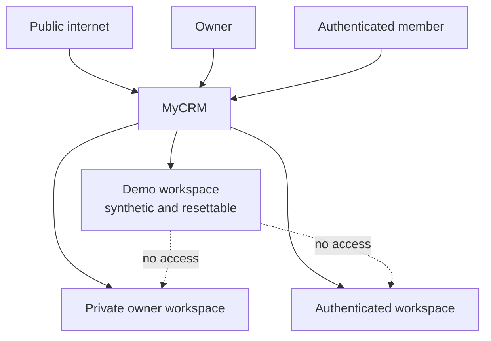
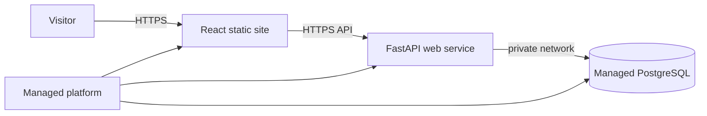

# Stage 0.5: Public Production and Demo Architecture

This document extends the Stage 0 foundation for a new product requirement:
MyCRM must not be limited to one owner's local machine. It must be deployed to
production and provide a public, portfolio-quality demonstration that anyone
can explore safely.

Stage 0.5 is primarily an architecture and production-readiness stage. It
defines the boundaries that must exist before Stage 1 creates CRM tables. Some
items are documentation decisions now and implementation tasks during Stages 1
and 2.

## 1. Why this stage is necessary

The Stage 0 application is a sound local foundation:

- FastAPI and React are separated cleanly;
- PostgreSQL is available through Docker Compose;
- dependencies are locked;
- health checks, error handling, logging, migrations, tests, and CI exist;
- the future AI safety boundary is documented.

However, a public internet deployment introduces conditions that do not exist
on a local machine:

- every visitor is untrusted;
- concurrent users may access the application;
- a visitor must never see the owner's private data;
- anonymous writes can vandalize shared data;
- external actions can send spam or create real-world side effects;
- AI calls create variable cost and can be automated by bots;
- secrets, database ports, backups, HTTPS, and deployment failures become
  operational concerns;
- the application itself becomes part of the portfolio experience.

These concerns affect data ownership. If they are postponed until after domain
tables exist, every table and repository must be migrated later. Stage 0.5
therefore defines the tenant boundary before Stage 1.

## 2. Product modes

MyCRM will support three compatible operating modes.

### Private owner mode

The owner uses a private workspace with real data. Public visitors cannot see or
modify this workspace.

### Authenticated workspace mode

Future registered users or team members may use isolated workspaces. This mode
does not need every enterprise feature in the first release, but the data model
must not prevent it.

### Public demo mode

An anonymous visitor can open a live demo containing realistic synthetic data.
The demo is temporary, limited, observable, and resettable. It never shares a
data boundary with the private owner workspace.



## 3. The workspace ownership boundary

A `Workspace` is the primary tenant and ownership boundary.

```text
User
  -> WorkspaceMembership
      -> Workspace
          -> Contacts
          -> Companies
          -> Pipelines
          -> Deals
          -> Tasks
          -> Activities
          -> Notes
          -> Audit records
          -> Events
          -> AI runs
```

### Core identity entities

#### `users`

Represents an authenticated identity. Authentication credentials should be
kept separate from profile and domain data where practical.

Suggested fields:

```text
id
email or external_subject
display_name
status
created_at
updated_at
```

#### `workspaces`

Represents one isolated CRM environment.

Suggested fields:

```text
id
name
slug
kind              private | team | demo
status            active | read_only | resetting | disabled
created_at
updated_at
```

#### `workspace_memberships`

Connects a user to a workspace and defines the role inside that workspace.

Suggested fields:

```text
id
workspace_id
user_id
role
status
created_at
```

An initial unique constraint should prevent duplicate membership:

```text
UNIQUE (workspace_id, user_id)
```

#### `demo_sessions`

Optionally associates an anonymous browser session with a demo workspace.

Suggested fields:

```text
id
workspace_id
session_hash
expires_at
created_at
last_seen_at
```

Raw session tokens must not be stored in the database. Store a cryptographic
hash and send the original token only in a secure cookie.

## 4. Rules for workspace-owned tables

Every business table must contain:

```text
workspace_id UUID NOT NULL
```

This includes obvious entities such as contacts and deals, but also supporting
records:

- tags and relationship tables;
- attachments;
- imports and sync cursors;
- audit logs;
- outbox events;
- notifications;
- AI runs and suggestions;
- knowledge documents and chunks;
- embeddings;
- automation definitions and executions.

### Workspace-scoped uniqueness

A business key is generally unique inside a workspace, not globally.

Examples:

```text
UNIQUE (workspace_id, pipeline_name)
UNIQUE (workspace_id, tag_name)
UNIQUE (workspace_id, external_source, external_id)
```

A global uniqueness constraint on `tag_name`, for example, would incorrectly
prevent two independent workspaces from using the same tag.

### Workspace-scoped relationships

A foreign key alone does not always prove that related records belong to the
same workspace. Application rules and, where appropriate, composite constraints
must prevent a deal in workspace A from referring to a pipeline stage in
workspace B.

## 5. Workspace context in the application

The active workspace must be explicit throughout a request.

```text
HTTP request
  -> authenticate or resolve demo session
  -> resolve workspace
  -> verify membership/demo policy
  -> create WorkspaceContext
  -> call application use case
  -> repository query scoped by workspace_id
```

A future context object may contain:

```python
class WorkspaceContext:
    workspace_id: UUID
    actor_id: UUID | None
    role: WorkspaceRole
    mode: WorkspaceMode
```

The context is not accepted from a request body as trusted data. The backend
derives it from authentication, membership, route selection, and demo-session
state.

## 6. Authorization layers

Authorization should exist at more than one level.

### HTTP layer

Rejects missing or malformed authentication and resolves the current workspace.

### Application layer

Decides whether the actor may execute a business use case. This is the primary
authorization boundary.

### Repository layer

Every query requires workspace scope. A repository must not provide an easy
unscoped `get_by_id(id)` method for tenant-owned data. Prefer an interface such
as:

```text
get_by_id(workspace_id, entity_id)
```

### Database layer

PostgreSQL Row-Level Security can provide defense in depth by filtering rows
according to a transaction-local workspace setting. It is valuable but must be
tested carefully: table owners and roles with `BYPASSRLS` may bypass policies.

Official reference:
[PostgreSQL Row-Level Security](https://www.postgresql.org/docs/17/ddl-rowsecurity.html).

## 7. Cross-workspace security tests

Every workspace-owned module needs negative tests, not only successful CRUD
tests.

Required scenarios include:

- user A cannot read user B's contact by guessing its UUID;
- user A cannot update or delete user B's deal;
- filters and search never return records from another workspace;
- activity history does not cross the workspace boundary;
- exports contain data only from the active workspace;
- background jobs reject a mismatched workspace/entity pair;
- AI context retrieval cannot retrieve another workspace's notes;
- embeddings and semantic search remain workspace-scoped;
- audit and error details do not leak another workspace's data;
- demo visitors cannot access private routes by calling the API directly.

Security tests should use at least two workspaces in the same test database. A
single-workspace fixture cannot prove isolation.

## 8. Public demo threat model

The public demo is exposed to accidental misuse and deliberate abuse.

### Threats

- automated creation of thousands of records;
- vandalism of shared names and notes;
- offensive or illegal content;
- scripted AI calls that exhaust the budget;
- prompt injection inside user-controlled text;
- oversized payloads and files;
- email or calendar spam;
- attempts to access private workspace IDs;
- scraping of logs, errors, or API documentation for secrets;
- denial of service through expensive filters or search queries.

### General response

Use multiple controls rather than relying on one mechanism:

- synthetic data only;
- authentication or anonymous session identity;
- workspace isolation;
- request and payload limits;
- per-IP and per-session rate limits;
- global cost and concurrency limits;
- disabled external side effects;
- periodic reset;
- audit logs and abuse metrics;
- read-only incident fallback;
- the ability to disable demo mode without disabling the owner's workspace.

## 9. Demo lifecycle

### Seed

Demo data comes from a versioned seed dataset stored or generated by the
project. It should include realistic relationships:

- several companies;
- contacts with different roles;
- multiple pipelines and deal stages;
- won, lost, active, and stalled deals;
- tasks with different priorities and due dates;
- activities and notes that make AI summaries meaningful;
- no real names, emails, phone numbers, or copied private conversations.

The seed operation must be idempotent: running it twice must not create duplicate
records.

### Use

The UI displays a permanent demo banner explaining:

- the data is synthetic;
- changes are temporary;
- data resets periodically;
- some external operations are disabled;
- AI usage may be limited.

### Reset

Reset is a controlled application or administration use case, not an arbitrary
SQL script executed by a visitor.

Possible sequence:

```text
mark workspace as resetting
  -> stop new writes
  -> delete/recreate demo-owned data in one controlled transaction or job
  -> apply the current seed version
  -> verify expected record counts and relationships
  -> mark workspace active
```

The reset must never accept a private workspace accidentally. A workspace must
be explicitly classified as `demo`, and reset code must enforce that invariant.

## 10. Shared versus ephemeral demo workspaces

### Shared resettable workspace

All visitors see one demo workspace.

Advantages:

- simplest implementation;
- low database usage;
- easy to seed and reset.

Disadvantages:

- visitors can interfere with one another;
- data may change during a demonstration;
- offensive content is visible until reset.

This is acceptable for an initial read-mostly portfolio demo with strict write
limits and frequent resets.

### Per-session ephemeral workspace

Each visitor receives a temporary workspace cloned from the seed.

Advantages:

- visitors do not interfere with each other;
- write operations can be demonstrated safely;
- each session starts from a known state.

Disadvantages:

- more storage and cleanup work;
- session provisioning and expiration are required;
- abuse can create many workspaces without rate limits.

The initial design supports both. Start shared if the demo is mostly read-only;
upgrade to ephemeral workspaces when interactive writes become a portfolio
priority.

## 11. Demo permissions and side effects

The backend enforces demo restrictions. Hiding a button is useful UX but not a
security control.

### Safe initial capabilities

- browse seeded contacts and companies;
- filter and sort lists;
- inspect deal pipelines;
- open tasks and activity history;
- run bounded search;
- view prepared or low-cost AI summaries;
- create temporary drafts within strict limits.

### Disabled until explicitly secured

- real email sending;
- calendar writes;
- webhooks to arbitrary URLs;
- imports from external accounts;
- unrestricted file uploads;
- permanent deletion;
- account invitations;
- bulk export;
- arbitrary automation execution;
- AI tools with external side effects.

## 12. AI controls in a public demo

An AI endpoint has both security risk and direct monetary cost.

Every public AI capability needs:

- a per-session request allowance;
- a per-IP rate limit;
- a global daily budget;
- a maximum input size;
- a maximum output size;
- a timeout and maximum number of tool steps;
- a safe structured-output schema;
- workspace-scoped context retrieval;
- cached or precomputed examples where live generation adds little value;
- a fallback response when the provider or budget is unavailable;
- metrics for accepted, rejected, failed, and blocked requests.

Provider credentials remain exclusively on the backend. They are never embedded
in React bundles or returned to the browser.

## 13. Local and production environments

Local Docker Compose remains a development tool. It intentionally publishes
ports and uses developer-friendly defaults.

Production must not be a copy of local Compose with a public IP.

### Local environment

```text
React/nginx: localhost:8080
FastAPI:     localhost:8000
PostgreSQL:  localhost:5432
```

### Production environment



Only the frontend and API are publicly addressable. PostgreSQL has no public
application port.

## 14. Initial deployment target

The initial direction is a managed platform rather than a self-managed VPS.

The reference deployment is:

- React as a static site;
- FastAPI as a Docker web service;
- PostgreSQL as a managed private database;
- automatic HTTPS and certificate renewal;
- secrets configured by the platform;
- health checks and automatic restarts;
- deployment from a protected Git branch.

Render is the default first target because it supports these capabilities while
keeping domain code portable. The decision is recorded in
[ADR 0005](../docs/adr/0005-managed-production-deployment.md).

Official references:

- [Render Web Services](https://render.com/docs/web-services);
- [Render Custom Domains](https://render.com/docs/custom-domains);
- [Render Health Checks](https://render.com/docs/health-checks).

## 15. Production configuration

Production configuration must be explicit and fail closed.

### Required principles

- `MYCRM_APP_ENV=production` is mandatory;
- no production database URL has a source-code default;
- no password falls back to `change-me`;
- CORS contains exact production origins;
- allowed hosts are explicit;
- the public API URL is provided to the frontend build;
- interactive API documentation is controlled by a separate setting;
- log level and error behavior are environment-specific;
- the application validates required production settings at startup.

### Documentation setting

The current code disables `/docs` whenever the environment is production. A
portfolio can benefit from public OpenAPI documentation. Introduce a separate
setting such as:

```text
MYCRM_ENABLE_DOCS=true|false
```

This allows documentation policy to change independently from security and
runtime environment.

## 16. Frontend-to-API routing

Local nginx uses the Docker service name:

```nginx
proxy_pass http://api:8000;
```

That name exists only inside the local Compose network. A separately deployed
static frontend needs a production API URL.

Preferred first deployment:

```text
VITE_API_URL=https://api.example.com
```

Vite variables are embedded at build time. They must contain only public
configuration, never secrets.

FastAPI then permits the exact frontend origin:

```text
MYCRM_CORS_ORIGINS=["https://app.example.com"]
```

An alternative is a same-origin production reverse proxy. It simplifies CORS
but adds proxy configuration. Both approaches are valid; the deployment
manifest must choose one explicitly.

## 17. HTTPS and proxy headers

HTTPS should be terminated by the managed platform or a trusted reverse proxy.
FastAPI must understand forwarded protocol and host information for redirects
and generated URLs.

Only headers from a trusted proxy should be accepted. Blindly trusting
`X-Forwarded-*` from the public internet allows spoofed client and protocol
information.

Official references:

- [FastAPI deployment concepts](https://fastapi.tiangolo.com/deployment/concepts/);
- [FastAPI HTTPS and forwarded headers](https://fastapi.tiangolo.com/deployment/https/);
- [FastAPI in containers](https://fastapi.tiangolo.com/deployment/docker/).

## 18. Production secrets

Secrets include:

- database credentials;
- session or token signing keys;
- OAuth client secrets;
- AI-provider API keys;
- email and calendar credentials;
- object-storage credentials;
- monitoring DSNs that are not intended for the browser.

Rules:

- never commit real secrets;
- never include secrets in Docker build arguments or frontend variables;
- never print complete connection URLs in logs;
- rotate leaked or shared secrets;
- use separate credentials for local, staging, and production;
- grant each service only the secrets it needs;
- document rotation without documenting secret values.

Docker Compose supports per-service secret mounts, and managed platforms provide
their own secret stores:
[Docker Compose secrets](https://docs.docker.com/compose/how-tos/use-secrets/).

## 19. Migration and release strategy

Schema migration is a deployment step, not an application-instance side effect.

Recommended release sequence:

```text
build immutable artifacts
  -> run automated tests
  -> back up or confirm recovery point
  -> run alembic upgrade head once
  -> deploy new application instances
  -> run smoke checks
  -> route traffic
```

Do not let every web worker run migrations concurrently at startup. A managed
platform should use a pre-deploy/release command or a dedicated one-off job.

Every migration should be designed for safe rolling deployment when possible:

1. add backward-compatible schema;
2. deploy code that understands both states;
3. backfill data separately when needed;
4. remove obsolete schema in a later release.

## 20. Production CI/CD requirements

The current CI checks Python and frontend code. Public production adds the
following requirements:

### Backend

- run unit tests;
- start a real PostgreSQL service;
- apply migrations to an empty database;
- test repository and transaction behavior;
- run cross-workspace access tests;
- build the production Docker image;
- start the image and call liveness/readiness endpoints.

### Frontend

- run lint, type checking, and production build;
- verify that required public environment variables are handled;
- build the production image or static artifact;
- run a smoke test against the built artifact.

### Repository and supply chain

- dependency update automation;
- secret scanning;
- dependency vulnerability review;
- pinned and reviewed CI actions;
- optional image SBOM and vulnerability scanning;
- deployment only after required checks pass.

### Deployment

- automatic staging deployment is preferred;
- production deployment should use a protected branch or explicit approval;
- a failed health check blocks traffic;
- rollback instructions are documented and tested.

## 21. Observability

JSON logs and request IDs are the Stage 0 base. Production also needs:

- centralized log retention;
- error reporting with stack traces and environment tags;
- uptime checks for frontend and API;
- latency, status-code, and request-rate metrics;
- database connection-pool metrics;
- deployment markers;
- demo reset success/failure metrics;
- rate-limit and abuse counters;
- AI request, latency, token, and cost metrics;
- alerts that are actionable rather than noisy.

Logs must not contain passwords, authorization tokens, complete database URLs,
private notes, raw AI prompts with sensitive data, or uploaded file content.

## 22. Backups and recovery

A managed database reduces operational work but does not remove the need for a
recovery plan.

Document:

- backup frequency and retention;
- whether point-in-time recovery is available;
- who can restore production;
- how a restore is tested;
- expected recovery time;
- how attachments and database records remain consistent;
- how demo data can be rebuilt independently from private data.

A backup that has never been restored is only an assumption. Run periodic
restore exercises against a non-production environment.

## 23. Portfolio experience

The public deployment is part of the project presentation.

Recommended elements:

- a concise landing page explaining the problem and engineering approach;
- a prominent `Open live demo` action;
- a visible demo-mode banner;
- a guided path through contacts, deals, tasks, activities, and later AI;
- realistic synthetic seed data;
- a GitHub repository link;
- architecture and data-flow diagrams;
- a link to API documentation;
- screenshots or a short demonstration video in the README;
- a clear list of engineering practices and tradeoffs;
- public status or last-deployment information when useful.

The demo should quickly answer three questions for a reviewer:

1. What business problem does this product solve?
2. What can I interact with right now?
3. Which engineering decisions demonstrate the author's experience?

## 24. Privacy and public-input policy

The safest initial demo asks visitors not to enter real personal information and
stores only temporary synthetic content.

If the application later accepts registration or persistent user content,
additional work becomes mandatory:

- privacy policy;
- terms of use;
- account and data deletion;
- retention rules;
- analytics and cookie disclosure where applicable;
- abuse reporting and moderation;
- provider data-processing and regional-storage review.

This is both a legal and product-design boundary and should be revisited before
persistent public accounts are enabled.

## 25. Stage 0.5 deliverables

### Completed in documentation and code

- public-production product direction;
- workspace ownership boundary;
- public demo threat model and lifecycle;
- managed deployment direction;
- local versus production separation;
- production secret, HTTPS, migration, CI/CD, backup, and observability rules;
- ADR 0003: workspace isolation;
- ADR 0004: public demo mode;
- ADR 0005: managed production deployment;
- Stage 1 constraints in the project plan.
- production settings with fail-closed validation;
- independent OpenAPI documentation configuration;
- identity, workspace, membership, and demo-session SQLAlchemy models;
- a reversible Alembic migration for the ownership schema;
- a trusted `WorkspaceContext` and explicit cross-workspace rejection;
- a backend policy that disables external side effects in demo workspaces;
- initial request-size and per-instance rate limits;
- exact allowed-host and CORS configuration;
- a public demo-capabilities endpoint;
- a Render deployment blueprint with a pre-deploy migration command;
- CI migration, container-build, and end-to-end smoke checks.

### Remaining work before or during early Stage 1

- synthetic seed and reset use cases;
- authentication-backed workspace resolution;
- workspace-scoped CRM repositories and database integration tests;
- Redis-backed distributed rate limits before horizontal scaling;
- monitoring, backup restoration, and rollback verification in the deployed
  environment.

## 26. Stage 0.5 acceptance checklist

Architecture documentation is complete when:

- [x] a workspace is the explicit data-ownership boundary;
- [x] every future CRM table is required to have `workspace_id`;
- [x] demo and private data are separate;
- [x] demo reset and restriction rules are documented;
- [x] local Compose is classified as development-only;
- [x] a managed production topology is selected;
- [x] production secrets, HTTPS, migrations, CI/CD, monitoring, and backups have
  documented requirements;
- [x] relevant ADRs exist;
- [x] the project roadmap includes Stage 0.5;
- [x] Stage 1 includes workspace-aware models and isolation tests.

Production implementation is ready for a public launch only when:

- [ ] the frontend and API are reachable over HTTPS;
- [ ] PostgreSQL is reachable only through a private network;
- [x] production configuration rejects fallback secrets and unsafe origins;
- [x] migrations have a single pre-deploy release command;
- [x] the workspace context rejects mismatched workspace IDs;
- [ ] synthetic demo seed and reset are tested;
- [x] external side effects are disabled in demo mode;
- [x] public endpoints have initial rate and payload limits;
- [ ] error monitoring and uptime checks are active;
- [ ] backup restoration has been verified;
- [ ] rollback instructions have been tested;
- [ ] the README contains the live URL and clear demo instructions.

## 27. Constraints imposed on Stage 1

Stage 1 must not introduce a tenant-owned table without a workspace boundary.

Stage 1 must establish the following order:

1. identity primitives;
2. `Workspace` and `WorkspaceMembership`;
3. workspace resolution and authorization context;
4. two-workspace security test fixtures;
5. workspace-owned CRM models;
6. workspace-scoped repositories and use cases;
7. audit records with actor and workspace;
8. synthetic demo seed;
9. demo restrictions enforced by the backend;
10. public deployment after these boundaries are proven.

This ordering prevents public-production requirements from becoming a costly
retrofit.

## 28. Result of Stage 0.5

MyCRM is no longer architected only as a local personal tool. It now has a
documented path to becoming:

- a private CRM for the owner;
- a workspace-isolated application for future users;
- a safe public portfolio demo;
- a production deployment with explicit operational responsibilities;
- an AI-enabled product whose public costs and side effects remain controlled.

The repository can now enter Stage 1 with a stable ownership boundary. The
identity and workspace foundation exists; the next implementation task is to
derive `WorkspaceContext` from real authentication or a demo session before
workspace-owned CRM repositories are introduced.

## 29. Implemented data foundation

The migration `20260715_0002_workspace_foundation.py` creates `users`,
`workspaces`, `workspace_memberships`, and `demo_sessions`. UUID primary keys
avoid exposing sequential record counts and work well across future import and
background-processing boundaries. UTC-aware timestamps avoid ambiguity when
the owner, visitors, and infrastructure use different time zones.

Roles, workspace kinds, and statuses are constrained in both Python and SQL.
Python enums make invalid application states difficult to construct, while SQL
check constraints protect the database from invalid values written by scripts
or future services. The unique `(workspace_id, user_id)` constraint prevents a
person from receiving duplicate memberships in one workspace.

Raw anonymous-session tokens are intentionally absent from the schema. The
`session_hash` column is designed to store only a one-way hash, so a database
leak does not immediately expose usable browser credentials.

## 30. Trusted workspace context and demo policy

`WorkspaceContext` is a frozen value object containing the resolved workspace,
actor, role, kind, and status. Freezing it prevents application code from
silently changing the security scope halfway through a request. Its
`assert_scope()` method rejects an entity whose `workspace_id` differs from the
trusted context, and tests exercise this negative case with two different IDs.

The context is deliberately not populated from a request payload yet. Stage 1
must derive it from authenticated membership or a server-resolved demo session.
Accepting a client-provided `workspace_id` as authority would let an attacker
select another tenant directly.

External effects are controlled by a backend policy. A demo workspace cannot
send email, modify calendars, call arbitrary webhooks, export data, or execute
automations even if a future frontend accidentally displays such a button.

## 31. Fail-closed production settings

Local development retains convenient defaults. Production does not. When
`MYCRM_APP_ENV=production`, startup validation requires:

- a non-local PostgreSQL host;
- no `change-me` database password;
- an application secret containing at least 32 characters;
- explicit HTTPS CORS origins;
- explicit allowed hosts without a wildcard.

Managed platforms commonly provide `postgres://` or `postgresql://` connection
strings. The settings layer converts those schemes to
`postgresql+asyncpg://`, keeping platform configuration compatible with the
asynchronous SQLAlchemy engine.

OpenAPI is controlled by `MYCRM_ENABLE_DOCS`, independently of the environment.
This lets the portfolio expose useful API documentation without weakening the
other production checks.

## 32. Public request boundary

Trusted-host middleware rejects unexpected `Host` headers, and CORS permits
only configured frontend origins. The request middleware rejects declared
bodies larger than the configured limit and applies an initial fixed-window
limit per client address to versioned API routes. Rejections use the same
machine-readable error envelope and request ID as the rest of the API.

The limiter is intentionally documented as single-instance infrastructure. It
is sufficient for the initial one-instance deployment, but its counters live in
process memory. Before the backend is scaled horizontally or expensive AI
endpoints are opened, it must be replaced by a shared Redis-backed limiter with
per-session and global cost budgets.

## 33. Deployment and release path

`render.yaml` describes three managed resources:

1. the React application as a static site;
2. FastAPI as a Docker web service;
3. PostgreSQL as a managed database connected through the platform.

Alembic runs through `preDeployCommand` before the new API release starts. This
avoids the race created when every web process attempts migration during
startup. The frontend receives only the public API URL at build time; database
credentials and application secrets remain backend-only environment values.

CI now runs migrations against a real PostgreSQL service, tests downgrade and
re-upgrade, and starts the complete Compose stack for a smoke request through
the public nginx entry point. This catches failures that isolated unit tests or
offline SQL generation cannot detect.

## 34. Verification boundary

The implementation is covered by configuration, API-boundary, demo-policy, and
workspace-isolation tests. Ruff, formatting, strict mypy checks, pytest, Alembic
SQL compilation, frontend linting, TypeScript checking, and a production Vite
build pass locally.

The complete local Docker Compose startup was subsequently verified by the
project owner. Stage 1 migrations and isolation tests were also executed
against the local PostgreSQL container. The same checks remain encoded in CI.
A public launch is still intentionally incomplete until the managed deployment
exists and HTTPS, private database networking, monitoring, backup restoration,
and rollback have been tested against that real environment.
