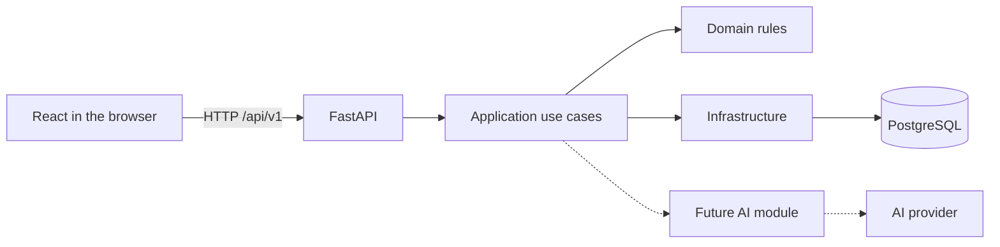

# Stage 0: The MyCRM Foundation

This document explains what was built during the first technical stage of
MyCRM, why this approach was selected, and how each part will be used as the
project grows.

It is both project documentation and a learning resource. Its purpose is not
only to provide commands to copy, but also to explain architectural decisions,
the HTTP request lifecycle, migrations, containers, automated checks, and the
boundary between deterministic business logic and the future AI layer.

## 1. What “Stage 0” means

Contacts, deals, tasks, and AI features have not been implemented yet. The first
step was to create a foundation on which those capabilities can be built safely.

The foundation ensures that:

- the application is organized consistently for every developer;
- dependencies use known and reproducible versions;
- the backend and frontend can be started independently;
- database changes are managed through controlled migrations;
- API errors have one stable shape;
- every request can be traced with a unique identifier;
- “the process is alive” and “the service is ready” are checked separately;
- code is checked automatically before it reaches the main branch;
- architectural decisions are documented instead of living only in the
  developer's memory.

The “foundation first” approach reduces the cost of later changes. If dozens of
tables and endpoints are written immediately, mistakes in project structure,
configuration, or migrations must be fixed while preserving already-developed
business logic.

## 2. Selected technology stack

### Backend

- Python 3.12;
- FastAPI;
- Pydantic and Pydantic Settings;
- SQLAlchemy 2.x with its asynchronous API;
- asyncpg;
- Alembic;
- pytest, Ruff, and mypy.

### Data

- PostgreSQL 18;
- a named Docker volume for local data persistence.

### Frontend

- React 19;
- TypeScript;
- Vite 8;
- ESLint;
- pnpm.

### Infrastructure

- Docker and Docker Compose;
- GitHub Actions;
- uv for Python dependency management;
- lock files for both Python and JavaScript.

## 3. Why a modular monolith was selected

The backend is currently one FastAPI application deployed as one service, but
its code is divided into modules and layers.

This approach is called a **modular monolith**.



A monolith does not mean that all code lives in one file or that boundaries do
not exist. It means that the first version avoids artificial separation into
networked services.

### Benefits for MyCRM

- one transaction can update a deal, write an audit record, and create an event
  atomically;
- local development and debugging are simpler;
- service discovery, distributed transactions, and monitoring for many small
  services are unnecessary;
- operational cost stays low for a personal product;
- clear module boundaries still allow a component to be extracted later.

### Why not microservices

Microservices are valuable when there are separate teams, independent release
cycles, distinct scaling requirements, or strong fault-isolation requirements.
MyCRM has none of these conditions yet. Introducing microservices now would add
network failures and data-consistency complexity without adding user value.

The decision is recorded in
[ADR 0001](../docs/adr/0001-modular-monolith.md).

## 4. Repository structure

```text
MyCRM/
├── about/                       # educational explanations of each stage
├── backend/
│   ├── alembic/                 # database migrations
│   ├── src/mycrm/
│   │   ├── core/                # configuration and infrastructure core
│   │   ├── modules/             # business modules
│   │   ├── api.py               # API v1 assembly
│   │   └── main.py              # FastAPI application factory
│   ├── tests/                   # backend tests
│   ├── Dockerfile
│   ├── pyproject.toml
│   └── uv.lock
├── frontend/
│   ├── src/                     # React source code
│   ├── Dockerfile
│   ├── nginx.conf
│   ├── package.json
│   └── pnpm-lock.yaml
├── docs/
│   ├── adr/                     # Architecture Decision Records
│   └── PROJECT_PLAN.md
├── .github/workflows/ci.yml
├── .env.example
├── compose.yaml
└── README.md
```

### Why the backend uses a `src/` layout

The Python package is stored in `backend/src/mycrm`, rather than directly in
`backend/mycrm`.

The `src` layout helps expose packaging errors. Tests and tools must import the
installed package or an explicitly configured source path instead of
accidentally importing a directory from the current working directory. This is
especially useful when the application is built as a wheel or Docker image.

## 5. How the FastAPI application is created

The main entry point is
[`backend/src/mycrm/main.py`](../backend/src/mycrm/main.py).

Instead of configuring every component in one large global block, the project
uses a `create_app()` function.

It performs the following steps:

1. Loads settings.
2. Creates the `FastAPI` object.
3. Enables or disables interactive documentation based on the environment.
4. Configures JSON logging.
5. Adds CORS support.
6. Adds request-ID middleware.
7. Registers common error handlers.
8. Includes the versioned API router.

This pattern is known as an **application factory**. It makes testing easier and
allows different application variants to be created later with different
settings.

### Lifespan

FastAPI supports a lifespan context: code before `yield` runs at startup, while
code after `yield` runs during shutdown.

The current application disposes of the SQLAlchemy engine when it stops:

```python
@asynccontextmanager
async def lifespan(app: FastAPI):
    app.state.logger.info("Application started")
    yield
    await engine.dispose()
    app.state.logger.info("Application stopped")
```

Lifespan can later initialize clients for external services or validate
mandatory configuration. Long-running business operations do not belong there.

## 6. The HTTP request path

Consider this request:

```http
GET /api/v1/health/live
```

It moves through the backend as follows:

```text
HTTP client
  -> CORS middleware
  -> request-ID middleware
  -> FastAPI router
  -> health/live endpoint
  -> Pydantic response model
  -> JSON response
  -> completion log
  -> HTTP client
```

### `/api/v1` versioning

All application endpoints will be mounted under `/api/v1`. The version is part
of the external contract.

This does not mean every change requires `/api/v2`. A new API version is needed
only for an incompatible contract change that cannot be introduced safely in
the existing version.

### APIRouter

Health endpoints live in their own module and are included through an
`APIRouter`. The same approach will later be used for:

- `/contacts`;
- `/companies`;
- `/deals`;
- `/tasks`;
- `/activities`.

A router represents HTTP concerns and must not contain complex business logic.
For example, an endpoint that changes a deal's stage will call an application
use case such as `MoveDealToStage`; it will not execute several SQL statements
directly.

The official pattern for multi-file FastAPI applications is documented in
[FastAPI: Bigger Applications](https://fastapi.tiangolo.com/tutorial/bigger-applications/).

## 7. Liveness and readiness

Two separate endpoints were created:

```text
GET /api/v1/health/live
GET /api/v1/health/ready
```

### Liveness

Liveness answers this question:

> Is the application process alive and able to handle an HTTP request?

It does not access the database. If PostgreSQL is temporarily unavailable, the
FastAPI process is still alive, and restarting it will not necessarily repair
an external database outage.

### Readiness

Readiness answers a different question:

> Is this application instance ready to serve useful requests right now?

It executes `SELECT 1` through SQLAlchemy. If the database is unavailable, the
endpoint returns HTTP 503.

Docker uses the liveness endpoint to check the API container. In production, an
orchestrator can use readiness to stop routing traffic to an instance that has
lost an essential dependency.

Combining these checks often creates unnecessary restart loops during an outage
of an external service.

## 8. Application configuration

Settings are described by the `Settings` class in
[`backend/src/mycrm/core/config.py`](../backend/src/mycrm/core/config.py).

Pydantic Settings:

- reads environment variables;
- converts strings to typed values;
- validates permitted values;
- can read a local `.env` file;
- provides one consistent configuration object to the codebase.

The `MYCRM_` prefix is used, for example:

```text
MYCRM_APP_ENV=local
MYCRM_LOG_LEVEL=INFO
MYCRM_DATABASE_URL=postgresql+asyncpg://...
MYCRM_CORS_ORIGINS=["http://localhost:5173"]
```

### `.env.example` and `.env`

`.env.example` is committed to Git and documents which variables the
application needs. It must not contain real secrets.

`.env` contains local values and is excluded by `.gitignore`. Real passwords,
API keys, and tokens must never be placed in the README, source code, or commit
history.

The `change-me` value is only a visible local placeholder and must be replaced
before startup.

## 9. Asynchronous PostgreSQL access

Database setup lives in
[`backend/src/mycrm/core/database.py`](../backend/src/mycrm/core/database.py).

It uses:

- a SQLAlchemy asynchronous engine;
- asyncpg as the PostgreSQL driver;
- `async_sessionmaker`;
- the `get_session()` dependency.

### Why asynchronous I/O

An application frequently waits for the network or database. The asynchronous
model allows the event loop to serve other requests while the current request
waits for I/O.

Async does not make an individual SQL query faster and does not replace proper
indexes. It improves the efficiency of concurrent I/O waits. CPU-intensive work
must not block the event loop for a long time; it belongs in a worker or separate
process.

### One session per use-case context

`get_session()` creates an `AsyncSession` and closes it when the dependency
context ends.

In later stages, the application layer will control transaction boundaries:

```text
begin transaction
  -> validate business rules
  -> modify the aggregate
  -> write the audit record
  -> write the outbox event
commit
```

Repository methods should not call `commit` independently. One business action
needs one explicit atomic boundary.

## 10. Alembic and migrations

A migration is a versioned change to the database schema.

The initial migration currently creates only the `alembic_version` table, which
records the applied revision. CRM tables will be introduced during the next
stage.

Core commands:

```powershell
cd backend
uv run alembic upgrade head
uv run alembic current
uv run alembic history
```

After adding a SQLAlchemy model, a migration can be generated with:

```powershell
uv run alembic revision --autogenerate -m "create contacts"
```

Every generated migration must be reviewed manually. Autogenerate compares
metadata with the database but does not understand the business meaning of a
change. For example, it may interpret a renamed column as deletion followed by
creation, which could destroy data.

### Why tables must not be changed manually

A manual local database change cannot be reproduced in CI, production, or on
another developer's machine. A migration makes a change repeatable, reviewable,
and tied to a version of the codebase.

## 11. Common error format

The API returns errors in this shape:

```json
{
  "error": {
    "code": "http_404",
    "message": "Not Found",
    "request_id": "..."
  }
}
```

Validation errors also contain `details`.

### Why this matters

- the frontend does not need to parse many unrelated formats;
- `code` supports programmatic reactions and localization;
- `message` provides a human-readable explanation;
- `request_id` links a user-visible error to a log record.

Frontend behavior must not depend on matching `message` text. Messages can be
rewritten or translated, while a stable machine-readable `code` remains part of
the contract.

## 12. Request IDs and JSON logs

Middleware reads `X-Request-ID` from the incoming request. If it is absent, a
UUID is generated. The same identifier is:

- stored in `request.state`;
- added to the HTTP response;
- included in the log record;
- included in error responses.

Example JSON log:

```json
{
  "timestamp": "2026-07-14T12:00:00+00:00",
  "level": "INFO",
  "logger": "mycrm",
  "message": "HTTP request completed",
  "request_id": "6421...",
  "method": "GET",
  "path": "/api/v1/health/live",
  "status_code": 200,
  "duration_ms": 4.2
}
```

JSON is easier for centralized logging systems to process than unstructured
text: fields can be filtered, aggregated, and correlated across services.

A request ID is not a complete distributed tracing system. OpenTelemetry can
later add trace IDs and spans for database, queue, and AI-provider calls.

## 13. CORS

During local development, React runs on `localhost:5173`, while FastAPI runs on
`localhost:8000`. A browser treats these as different origins.

CORS middleware allows only origins listed in configuration. Without it, the
browser would block frontend access to the API even though both processes were
running.

Production should not use `allow_origins=["*"]` without a clear reason,
especially with credentials. Allowed origins should be explicit.

## 14. React and Vite

The frontend lives in `frontend/` and is a separate application.

### Why React

React is well suited for a CRM interface with significant interactive state:

- filters and tables;
- contact records;
- a deal pipeline;
- forms with drafts;
- AI-suggestion confirmation;
- background state updates.

### Why TypeScript

TypeScript checks data shapes before the application runs. This is especially
important in a CRM: confusion between a number, decimal monetary value, nullable
field, and string can lead to incorrect display or persistence.

A typed client will later be generated from FastAPI's OpenAPI schema, reducing
the risk of drift between the frontend and backend.

### Why Vite

Vite provides a development server, TypeScript/JSX processing, and a production
build. Create React App is deprecated, while React's official documentation
supports Vite for custom React applications:

- [React: Installation](https://react.dev/learn/installation);
- [Vite: Getting Started](https://vite.dev/guide/).

### The initial screen

The current `App.tsx` is not yet the CRM interface. It is a Stage 0 diagnostic
screen. On load, it calls the liveness endpoint and shows whether:

- the API is being checked;
- the API is online and reports its version;
- the API is unavailable.

This verifies the smallest vertical slice:

```text
Browser -> React -> Vite/nginx -> FastAPI -> HTTP response -> React state
```

## 15. Vite proxy and production nginx

In development, Vite proxies `/api` requests to `http://localhost:8000`. The
frontend can use a relative URL instead of repeating a local API address in
every component.

In the production Docker image, React is first compiled into static assets and
then served by nginx. nginx:

- serves `index.html`, JavaScript, and CSS;
- proxies `/api/` to the `api` container;
- returns `index.html` for client-side SPA routes.

React does not run as a Node.js server in production. After `vite build`, it is
a set of static files.

## 16. Docker Compose

[`compose.yaml`](../compose.yaml) defines three services.

### What Windows must have installed

Windows development requires Docker Desktop. It provides several distinct
components:

- **Docker Engine** — the background daemon that manages images, containers,
  networks, and volumes;
- **Docker CLI** — the `docker` terminal command;
- **Docker Compose v2** — the `docker compose` subcommand for multi-service
  applications;
- Docker Desktop UI and WSL 2 integration.

A Python `.venv` is unrelated to Docker. Activating `.venv` cannot provide the
`docker` command because Docker Engine is a separate system application, not a
Python library.

Do not run:

```powershell
pip install docker-compose
```

That package is the old Python-based Compose v1. It:

- does not install Docker Engine;
- does not create a running Docker daemon;
- uses the old `docker-compose` command with a hyphen;
- depends on outdated Python packages and may fail on modern Python;
- is unnecessary for this project's `compose.yaml`.

Modern Compose v2 is included with Docker Desktop and runs without a hyphen:

```powershell
docker compose up --build
```

Official installation instructions:
[Install Docker Desktop on Windows](https://docs.docker.com/desktop/setup/install/windows-install/).

### `db`

- uses the official `postgres:18-alpine` image;
- reads the database name and credentials from the environment;
- publishes local port 5432;
- persists data in `postgres_data`;
- is checked with `pg_isready`.

The official image changed its data layout in PostgreSQL 18. The volume is
mounted at `/var/lib/postgresql`, not the old `/var/lib/postgresql/data`. This is
essential for retaining data when a container is recreated. The change is
documented in the
[official PostgreSQL image documentation](https://github.com/docker-library/docs/blob/master/postgres/README.md#pgdata).

### `api`

- is built from `backend/Dockerfile`;
- reaches PostgreSQL through the internal service name `db`;
- starts only after PostgreSQL passes its healthcheck;
- publishes port 8000;
- has its own healthcheck.

### `web`

- builds React;
- runs nginx;
- waits for the API to become healthy;
- publishes port 8080.

### Why `depends_on` does not replace retries

`depends_on` helps define local startup order. PostgreSQL can still become
unavailable after startup. Background jobs and integrations must therefore
handle temporary failures and retry policies correctly.

## 17. The backend Dockerfile

The backend image uses Python 3.12 slim and uv.

Dependency files are copied first:

```dockerfile
COPY pyproject.toml uv.lock README.md ./
RUN uv sync --frozen --no-dev --no-install-project
```

Source code is copied later, followed by installation of the project itself.

This separation improves Docker layer caching. Editing one Python file does not
download every dependency again as long as `pyproject.toml` and `uv.lock` remain
unchanged.

`--frozen` prevents the lock file from changing during a build. `--no-dev`
excludes pytest, mypy, and Ruff from the production image.

### Why `.dockerignore` files are required

Every Docker build receives a **build context**: the files available to `COPY`.
The regular `.gitignore` does not control this context. Docker has separate
files:

```text
backend/.dockerignore
frontend/.dockerignore
```

Excluding frontend `node_modules` is especially important. Local dependencies
may be installed for Windows, while the image is built in Linux. If `COPY . .`
overwrites Linux `node_modules` with the local directory, pnpm detects an
inconsistent modules state or the build receives binaries for the wrong
platform.

The ignore files also exclude `dist`, `.venv`, Python caches, test results, logs,
and local `.env` files. This reduces the build context, improves build speed, and
prevents secrets from being copied into an image accidentally.

## 18. Python dependency management

[`backend/pyproject.toml`](../backend/pyproject.toml) serves several purposes:

- describes the package;
- defines the minimum Python version;
- lists runtime dependencies;
- lists development dependencies;
- configures pytest, Ruff, and mypy;
- tells FastAPI where the application entry point is.

`uv.lock` records the exact resolved dependency tree. This lets CI, Docker, and
local development use the same versions.

Typical workflow:

```powershell
cd backend
uv sync --dev
uv run pytest
```

To add a dependency:

```powershell
uv add package-name
```

Before adding a dependency, ask:

1. Does it solve a real problem?
2. Can the standard library solve the problem?
3. Is the package actively maintained?
4. What license does it use?
5. Which transitive dependencies and build scripts does it introduce?

## 19. Frontend dependency management

`package.json` describes dependencies and commands, while `pnpm-lock.yaml`
records exact versions.

Core commands:

```powershell
cd frontend
pnpm install
pnpm dev
pnpm lint
pnpm typecheck
pnpm build
```

`pnpm-workspace.yaml` explicitly permits a build script only for `esbuild`:

```yaml
allowBuilds:
  esbuild: true
```

Modern pnpm blocks unreviewed dependency install/build scripts. Instead of
disabling the protection globally, the project uses a minimal allowlist. This
reduces supply-chain risk. The mechanism is documented in
[pnpm settings](https://pnpm.io/settings#allowbuilds).

## 20. Automated checks

### Backend

Three tools serve different purposes.

#### Ruff

Ruff checks style, common mistakes, import ordering, and formatting.

```powershell
uv run ruff check .
uv run ruff format --check .
```

#### mypy

mypy runs in strict mode and verifies type annotations before code execution.

Static typing does not replace tests; it cannot prove that a business rule is
correct. It does, however, catch incompatible types, forgotten `None` cases, and
unclear function contracts.

#### pytest

pytest verifies observable application behavior. The current tests check that:

- liveness returns service metadata and a request ID;
- an unknown endpoint returns the common 404 format.

Tests use `httpx.AsyncClient` with an ASGI transport. Requests pass through the
real FastAPI application without opening a TCP port.

### Frontend

- ESLint verifies TypeScript and React code quality;
- `tsc` verifies types;
- `vite build` proves that the production bundle can be built.

## 21. CI with GitHub Actions

The workflow lives in
[`.github/workflows/ci.yml`](../.github/workflows/ci.yml).

Pull requests and pushes to `main` run independent jobs.

### Backend job

```text
checkout
  -> install Python and uv
  -> frozen dependency sync
  -> Ruff
  -> formatting check
  -> mypy
  -> pytest
  -> offline migration SQL check
```

### Frontend job

```text
checkout
  -> install pnpm and Node.js
  -> frozen dependency install
  -> ESLint
  -> TypeScript
  -> Vite production build
```

Separate jobs can run in parallel and make it immediately clear which part of
the application failed.

### Why CI matters when the code works locally

A local machine can contain an uncommitted file, global package, or cache that
hides a problem. CI runs in a clean environment and demonstrates that the
repository is self-contained.

## 22. Architecture Decision Records

An ADR is a short document that answers:

- what context existed;
- which decision was made;
- why it was made;
- which consequences and tradeoffs followed.

Stage 0 includes:

- [ADR 0001: modular monolith](../docs/adr/0001-modular-monolith.md);
- [ADR 0002: AI does not modify data directly](../docs/adr/0002-ai-safety-boundary.md).

An ADR should not repeat the entire codebase. It preserves the motivation behind
a decision, which is often impossible to reconstruct from source code six
months later.

When a decision changes, the old ADR is generally not rewritten as if it never
existed. A new ADR supersedes it and explains the changed conditions.

## 23. The future AI-layer boundary

Although no AI provider is connected yet, the main rule is already defined:

> A language model has no direct database access and is not the source of
> business rules.

The future flow will look like this:

```text
CRM data
  -> authorization and permitted-context selection
  -> model call
  -> JSON structured output
  -> Pydantic schema validation
  -> domain rules
  -> user confirmation when required
  -> application use case
  -> PostgreSQL transaction and audit record
```

This protects the system from several classes of failure:

- the model may be wrong;
- external text may contain prompt injection;
- the model may invent an ID;
- the current user may not be authorized to perform an action;
- an amount or stage change may violate a domain invariant.

AI will suggest, extract, search, or prepare a draft. The testable application
layer retains authority to change data.

## 24. What was intentionally left out

Stage 0 does not include:

- authentication;
- CRM tables;
- contact and deal CRUD;
- roles and permissions;
- Redis and a task queue;
- outbox events;
- email or calendar integrations;
- AI-provider calls;
- embeddings and pgvector;
- production deployment;
- backups and a monitoring stack.

These are not forgotten features. They require business context or belong to
later stages. Adding everything at once would make the foundation harder to
verify.

## 25. How to start the project

### Option 1: run everything with Docker

Docker Desktop is required.

```powershell
Copy-Item .env.example .env
```

Replace `change-me` in `.env`, then run:

```powershell
docker compose up --build
```

Addresses:

- React/nginx: <http://localhost:8080>;
- FastAPI: <http://localhost:8000>;
- Swagger UI: <http://localhost:8000/docs>;
- PostgreSQL: `localhost:5432`.

Stop the application with:

```powershell
docker compose down
```

Plain `docker compose down` does not delete the named data volume. Commands that
include `--volumes` delete data and must be used deliberately.

### Option 2: run services separately

PostgreSQL can run in Docker:

```powershell
docker compose up -d db
```

Backend:

```powershell
cd backend
uv sync --dev
uv run alembic upgrade head
uv run fastapi dev
```

Frontend in another terminal:

```powershell
cd frontend
pnpm install --frozen-lockfile
pnpm dev
```

In this mode, Vite is available at <http://localhost:5173> and proxies `/api` to
FastAPI.

## 26. How to check changes before a commit

Backend:

```powershell
cd backend
uv run ruff check .
uv run ruff format --check .
uv run mypy src
uv run pytest
uv run alembic upgrade head --sql
```

Frontend:

```powershell
cd frontend
pnpm lint
pnpm typecheck
pnpm build
```

These commands can later be combined with a task runner. At the learning stage,
it is useful to understand the purpose of each check separately.

## 27. Common problems and diagnostics

### The frontend displays “API unavailable”

Check:

1. Does <http://localhost:8000/api/v1/health/live> open?
2. Is the `api` container running?
3. Does the Vite proxy target the correct address?
4. Is the frontend origin permitted by `MYCRM_CORS_ORIGINS`?

### PowerShell reports: `docker is not recognized`

This means the Docker CLI is not installed or its directory is not yet present
in the current terminal's `PATH`.

Resolution steps:

1. Install Docker Desktop using the official instructions.
2. Select the WSL 2 backend when it is available.
3. Start Docker Desktop from the Windows Start menu.
4. Wait until the engine reports that it is running.
5. Close the old PowerShell window and open a new one to refresh `PATH`.
6. Verify the installation:

   ```powershell
   docker --version
   docker compose version
   docker run --rm hello-world
   ```

7. Return to the MyCRM root and run:

   ```powershell
   docker compose up --build
   ```

If `docker --version` works but Compose cannot connect to the engine, Docker
Desktop is installed but not running, or WSL 2 is not ready. Open Docker Desktop
and inspect its status.

A PyYAML build error after `pip install docker-compose` is unrelated to MyCRM.
It comes from trying to install obsolete Python Compose v1 with an incompatible
dependency tree. This project does not require a PyYAML downgrade.

### Liveness works, but readiness returns 503

FastAPI is alive but cannot query PostgreSQL. Check the `db` container, database
URL, credentials, and healthcheck.

### Alembic cannot connect to the database

Confirm that the command runs from `backend/` and `MYCRM_DATABASE_URL` uses the
correct host. Inside Docker the host is `db`; from the local machine it is
usually `localhost`.

### CI reports an outdated lock file

After changing dependencies, update and commit the appropriate lock file:

```powershell
cd backend
uv lock
```

or:

```powershell
cd frontend
pnpm install
```

## 28. Glossary

**API contract** — the agreed shape of routes, requests, responses, and errors.

**Application layer** — use cases that coordinate transactions and domain
rules.

**ASGI** — the asynchronous interface between a Python web server and
application.

**CORS** — a browser policy controlling access between different origins.

**Dependency injection** — providing a function's dependencies externally;
FastAPI uses `Depends` to supply settings, database sessions, and later the
current user.

**Domain invariant** — a rule that must remain true after every operation, such
as whether a deal may enter a particular stage.

**Event loop** — the mechanism that executes asynchronous work and switches
tasks while waiting for I/O.

**Healthcheck** — a technical check of a process or dependency.

**Idempotency** — repeating an operation does not produce an additional side
effect.

**Lock file** — a recorded tree of exact dependency versions.

**Middleware** — code that runs around every HTTP request.

**Migration** — a versioned database schema or data change.

**OpenAPI** — a machine-readable description of the HTTP API generated by
FastAPI.

**ORM** — a mapping between application objects and database tables or SQL
operations.

**Structured output** — model output that conforms to a defined schema rather
than unrestricted text.

**Transaction** — a group of database operations that is either committed or
rolled back as one unit.

## 29. What to study using this stage

Recommended order:

1. Open Swagger UI and call both health endpoints manually.
2. Trace the route from `main.py` to `modules/health/api.py`.
3. Change the version in Settings and observe the API and React output.
4. Send a custom `X-Request-ID` and find it in both the response and logs.
5. Stop PostgreSQL and compare liveness with readiness.
6. Read the SQL generated by `alembic upgrade head --sql`.
7. Introduce a TypeScript error intentionally and inspect `pnpm typecheck`.
8. Break a Python type intentionally and inspect mypy's output.
9. Study the Dockerfile layers and determine which edits invalidate the
   dependency cache.
10. Read the ADRs and formulate an alternative decision together with its
    consequences.

## 30. Stage result

Stage 0 produced more than an empty FastAPI endpoint and React page. It created
a testable foundation:

- the structure can grow into separate domain modules;
- the API has a stable version and error format;
- the database uses asynchronous access and managed migrations;
- the frontend can communicate with the backend;
- Docker describes the local environment;
- dependency versions are reproducible;
- CI verifies both sides of the application;
- AI integration rules are documented before dangerous actions exist.

The production and public-demo extension of this foundation is documented in
[Stage 0.5](STAGE_0_5_PUBLIC_PRODUCTION.md). After those ownership and deployment
boundaries are defined, Stage 1 can safely introduce domain models, application
use cases, repositories, transactions, auditing, and the first real user
operations.
