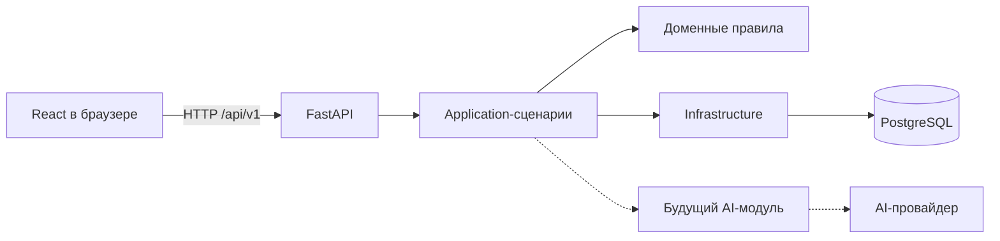

# Этап 0: фундамент MyCRM

Этот документ объясняет, что было сделано на первом техническом этапе MyCRM,
почему выбран именно такой подход и как устроенные части будут использоваться в
дальнейшей разработке.

Документ написан одновременно как описание проекта и как учебный материал. Его
задача — помочь не просто запускать готовые команды, а понимать архитектурные
решения, жизненный цикл HTTP-запроса, работу миграций, контейнеров, проверок и
границы между обычной бизнес-логикой и будущим ИИ-слоем.

## 1. Что означает «этап 0»

На этом этапе ещё не реализованы контакты, сделки, задачи или ИИ-функции. Сначала
создан фундамент, на котором эти возможности можно безопасно строить.

Фундамент решает следующие задачи:

- приложение одинаково организовано у всех разработчиков;
- зависимости имеют известные и воспроизводимые версии;
- backend и frontend запускаются независимо друг от друга;
- база данных изменяется через контролируемые миграции;
- ошибки API имеют единый формат;
- запрос можно проследить по уникальному идентификатору;
- существуют отдельные проверки «процесс работает» и «сервис готов работать»;
- код автоматически проверяется перед попаданием в основную ветку;
- архитектурные решения записаны, а не существуют только в памяти автора.

Подход «сначала инфраструктурный скелет» снижает стоимость последующих изменений.
Если начать сразу с десятков таблиц и endpoints, ошибки в структуре проекта,
конфигурации или миграциях придётся исправлять одновременно с уже написанной
бизнес-логикой.

## 2. Выбранный стек

### Backend

- Python 3.12;
- FastAPI;
- Pydantic и Pydantic Settings;
- SQLAlchemy 2.x с async API;
- asyncpg;
- Alembic;
- pytest, Ruff и mypy.

### Данные

- PostgreSQL 18;
- именованный Docker volume для локального хранения данных.

### Frontend

- React 19;
- TypeScript;
- Vite 8;
- ESLint;
- pnpm.

### Инфраструктура

- Docker и Docker Compose;
- GitHub Actions;
- uv для Python-зависимостей;
- lock-файлы для Python и JavaScript.

## 3. Почему выбран модульный монолит

Backend пока является одним приложением FastAPI и развёртывается как один
сервис. При этом код разделён на модули и слои.

Такой подход называется **модульным монолитом**.



Монолит здесь не означает, что весь код находится в одном файле или что между
частями нет границ. Это означает, что на первом этапе нет искусственного
разделения на отдельные сетевые сервисы.

### Преимущества для MyCRM

- одна транзакция может атомарно изменить сделку, записать аудит и создать
  событие;
- локальная разработка и отладка проще;
- не нужны service discovery, распределённые транзакции и отдельный мониторинг
  десятка сервисов;
- меньше инфраструктурных расходов для персонального продукта;
- границы модулей всё равно позволяют позднее вынести нагруженную часть.

### Почему не микросервисы

Микросервисы полезны, когда уже существуют разные команды, независимые циклы
релизов, разные требования к масштабированию или изоляции отказов. На старте
MyCRM этих условий нет. Разделение на микросервисы сейчас добавило бы сетевые
ошибки и сложность согласования данных, но не добавило бы пользовательской
ценности.

Решение зафиксировано в
[ADR 0001](../docs/adr/0001-modular-monolith.md).

## 4. Структура репозитория

```text
MyCRM/
├── about/                       # учебные объяснения этапов
├── backend/
│   ├── alembic/                 # миграции базы данных
│   ├── src/mycrm/
│   │   ├── core/                # конфигурация и инфраструктурное ядро
│   │   ├── modules/             # бизнес-модули
│   │   ├── api.py               # сборка API v1
│   │   └── main.py              # создание приложения FastAPI
│   ├── tests/                   # backend-тесты
│   ├── Dockerfile
│   ├── pyproject.toml
│   └── uv.lock
├── frontend/
│   ├── src/                     # React-код
│   ├── Dockerfile
│   ├── nginx.conf
│   ├── package.json
│   └── pnpm-lock.yaml
├── docs/
│   ├── adr/                     # Architecture Decision Records
│   └── PROJECT_PLAN.md
├── .github/workflows/ci.yml
├── .env.example
├── compose.yaml
└── README.md
```

### Почему backend использует `src/` layout

Python-пакет находится в `backend/src/mycrm`, а не непосредственно в
`backend/mycrm`.

`src` layout помогает обнаруживать ошибки упаковки: тесты и инструменты должны
импортировать установленный пакет или явно указанный source path, а не случайно
подхватывать папку из текущего рабочего каталога. Это особенно важно, когда
приложение собирается в wheel или Docker image.

## 5. Как создаётся приложение FastAPI

Главная точка входа находится в
[`backend/src/mycrm/main.py`](../backend/src/mycrm/main.py).

Вместо создания всех компонентов на уровне одного большого файла используется
функция `create_app()`.

Она выполняет несколько действий:

1. Загружает настройки.
2. Создаёт объект `FastAPI`.
3. Включает или выключает документацию в зависимости от окружения.
4. Настраивает JSON-логирование.
5. Подключает CORS.
6. Добавляет middleware с request ID.
7. Регистрирует обработчики ошибок.
8. Подключает версионированный API router.

Такой способ называется **application factory**. Он упрощает тестирование и
позволяет позднее создавать варианты приложения с разными настройками.

### Lifespan

FastAPI поддерживает lifespan-контекст: код до `yield` выполняется при запуске,
а код после `yield` — при остановке.

Сейчас при остановке освобождается SQLAlchemy engine:

```python
@asynccontextmanager
async def lifespan(app: FastAPI):
    app.state.logger.info("Application started")
    yield
    await engine.dispose()
    app.state.logger.info("Application stopped")
```

В дальнейшем lifespan может использоваться для инициализации клиентов внешних
сервисов или проверки обязательной конфигурации. В него не следует помещать
долгие бизнес-операции.

## 6. Путь HTTP-запроса

Рассмотрим запрос:

```http
GET /api/v1/health/live
```

Его путь через backend выглядит так:

```text
HTTP-клиент
  -> CORS middleware
  -> request ID middleware
  -> FastAPI router
  -> endpoint health/live
  -> Pydantic response model
  -> JSON response
  -> логирование результата
  -> HTTP-клиент
```

### Версионирование `/api/v1`

Все прикладные endpoints будут подключаться под `/api/v1`. Версия является
частью внешнего контракта.

Это не означает, что при каждом изменении нужно создавать `/api/v2`. Новая
версия понадобится только при несовместимом изменении контракта, которое нельзя
безопасно добавить в существующий API.

### APIRouter

Health endpoints находятся в отдельном модуле и подключаются через `APIRouter`.
В дальнейшем таким же образом будут подключены:

- `/contacts`;
- `/companies`;
- `/deals`;
- `/tasks`;
- `/activities`.

Router отвечает за HTTP-представление, но не должен содержать сложную
бизнес-логику. Например, endpoint изменения стадии сделки будет вызывать
application-сценарий `MoveDealToStage`, а не самостоятельно выполнять несколько
SQL-запросов.

Официальный подход к многофайловым FastAPI-приложениям описан в
[документации FastAPI](https://fastapi.tiangolo.com/tutorial/bigger-applications/).

## 7. Liveness и readiness

Созданы два разных endpoint:

```text
GET /api/v1/health/live
GET /api/v1/health/ready
```

### Liveness

Liveness отвечает на вопрос:

> Жив ли процесс приложения и способен ли он обработать HTTP-запрос?

Он не обращается к базе данных. Если PostgreSQL временно недоступен, сам процесс
FastAPI всё ещё жив. Перезапуск процесса не обязательно исправит внешнюю базу.

### Readiness

Readiness отвечает на другой вопрос:

> Готов ли экземпляр приложения обслуживать полезные запросы прямо сейчас?

Он выполняет `SELECT 1` через SQLAlchemy. Если база недоступна, возвращается
HTTP 503.

Docker использует liveness endpoint для проверки API-контейнера. В production
оркестратор может использовать readiness, чтобы временно перестать направлять
трафик на экземпляр, который потерял связь с обязательными зависимостями.

Смешивание этих двух проверок часто приводит к ненужным циклам перезапуска
работающего процесса во время сбоя внешнего сервиса.

## 8. Конфигурация приложения

Настройки описаны классом `Settings` в
[`backend/src/mycrm/core/config.py`](../backend/src/mycrm/core/config.py).

Pydantic Settings:

- читает переменные окружения;
- преобразует строки в типизированные значения;
- проверяет допустимые значения;
- может читать локальный `.env`;
- даёт коду единый объект конфигурации.

Используется префикс `MYCRM_`. Например:

```text
MYCRM_APP_ENV=local
MYCRM_LOG_LEVEL=INFO
MYCRM_DATABASE_URL=postgresql+asyncpg://...
MYCRM_CORS_ORIGINS=["http://localhost:5173"]
```

### `.env.example` и `.env`

`.env.example` хранится в Git и показывает, какие переменные нужны приложению.
Он не должен содержать настоящие секреты.

`.env` предназначен для локальных значений и исключён через `.gitignore`.
Настоящие пароли, API keys и токены нельзя помещать в README, исходный код или
commit history.

Значение `change-me` существует только как заметный локальный placeholder. Перед
запуском его нужно заменить.

## 9. Асинхронная работа с PostgreSQL

Подключение находится в
[`backend/src/mycrm/core/database.py`](../backend/src/mycrm/core/database.py).

Используются:

- SQLAlchemy async engine;
- asyncpg как PostgreSQL-драйвер;
- `async_sessionmaker`;
- dependency `get_session()`.

### Зачем async

Во время запроса приложение часто ожидает сеть или базу данных. Асинхронная
модель позволяет event loop обслуживать другие запросы, пока текущий запрос
ожидает I/O.

Async не делает отдельный SQL-запрос быстрее и не заменяет индексы. Он повышает
эффективность конкурентного ожидания I/O. CPU-тяжёлые операции нельзя выполнять
долго внутри event loop — их нужно выносить в worker или отдельный процесс.

### Сессия на сценарий запроса

`get_session()` создаёт `AsyncSession` и гарантированно закрывает её после
завершения dependency-контекста.

В следующих этапах границу транзакции будет контролировать application-слой:

```text
начало транзакции
  -> проверить бизнес-правила
  -> изменить агрегат
  -> записать аудит
  -> записать outbox event
commit
```

Важно не выполнять `commit` случайным образом в каждом repository-методе. Одна
бизнес-операция должна иметь понятную атомарную границу.

## 10. Alembic и миграции

Миграция — это версионированное изменение схемы базы данных.

Начальная миграция пока создаёт только таблицу `alembic_version`, в которой
хранится применённая версия. Таблицы CRM появятся на следующем этапе.

Основные команды:

```powershell
cd backend
uv run alembic upgrade head
uv run alembic current
uv run alembic history
```

После добавления SQLAlchemy-модели новую миграцию можно создать так:

```powershell
uv run alembic revision --autogenerate -m "create contacts"
```

Сгенерированную миграцию всегда нужно прочитать вручную. Autogenerate сравнивает
metadata с базой, но не понимает бизнес-смысл изменения. Например, переименование
колонки инструмент может ошибочно представить как удаление старой и создание
новой, что приведёт к потере данных.

### Почему нельзя просто менять таблицы вручную

Ручное изменение локальной базы не воспроизводится в CI, production или на
компьютере другого разработчика. Миграция делает изменение повторяемым,
проверяемым и привязанным к версии кода.

## 11. Единый формат ошибок

API возвращает ошибки в форме:

```json
{
  "error": {
    "code": "http_404",
    "message": "Not Found",
    "request_id": "..."
  }
}
```

Для ошибок валидации дополнительно возвращается `details`.

### Зачем это нужно

- frontend не должен разбирать десятки разных форматов;
- `code` можно использовать для программной реакции и локализации;
- `message` предназначен для понятного описания;
- `request_id` связывает ответ пользователя с записью в логах.

Не следует строить frontend-логику на сравнении текста `message`. Текст может
измениться или быть переведён, а стабильный машинный `code` остаётся контрактом.

## 12. Request ID и JSON-логи

Middleware читает `X-Request-ID` из входящего запроса. Если заголовка нет,
создаётся UUID. Этот же идентификатор:

- сохраняется в `request.state`;
- добавляется в HTTP-ответ;
- включается в запись лога;
- включается в тело ошибки.

Пример JSON-лога:

```json
{
  "timestamp": "2026-07-14T12:00:00+00:00",
  "level": "INFO",
  "logger": "mycrm",
  "message": "HTTP request completed",
  "request_id": "6421...",
  "method": "GET",
  "path": "/api/v1/health/live",
  "status_code": 200,
  "duration_ms": 4.2
}
```

JSON удобнее обычной строки для централизованных систем логирования: поля можно
фильтровать, агрегировать и связывать между сервисами.

Request ID пока не является полноценной distributed tracing системой. Позднее
можно добавить OpenTelemetry с trace ID и spans для запросов к БД, очереди и
AI-провайдеру.

## 13. CORS

В локальной разработке React работает на `localhost:5173`, а FastAPI — на
`localhost:8000`. Для браузера это разные origins.

CORS middleware разрешает только origins из конфигурации. Без него браузер
заблокировал бы frontend-доступ к API, даже если оба процесса работают.

В production нельзя без необходимости использовать `allow_origins=["*"]`,
особенно совместно с credentials. Список разрешённых origins должен быть явным.

## 14. React и Vite

Frontend находится в `frontend/` и является отдельным приложением.

### Почему React

React удобен для CRM-интерфейса, где много интерактивного состояния:

- фильтры и таблицы;
- карточки контактов;
- воронка сделок;
- формы с черновиками;
- подтверждение ИИ-предложений;
- фоновые обновления состояния.

### Почему TypeScript

TypeScript проверяет формы данных до запуска приложения. В CRM это особенно
важно: ошибка между `number`, денежным decimal-представлением, nullable-полем и
строкой может привести к неправильному отображению или сохранению данных.

В дальнейшем типизированный клиент будет генерироваться из OpenAPI FastAPI. Это
снизит риск рассинхронизации frontend и backend.

### Почему Vite

Vite предоставляет dev-сервер, обработку TypeScript/JSX и production-сборку.
Create React App устарел, а официальный React-материал допускает Vite для
самостоятельно собранных React-приложений:

- [React: Installation](https://react.dev/learn/installation);
- [Vite: Getting Started](https://vite.dev/guide/).

### Стартовый экран

Текущий `App.tsx` не является интерфейсом CRM. Это диагностическая точка первого
этапа. При загрузке он вызывает liveness endpoint и показывает:

- API проверяется;
- API работает и сообщает версию;
- API недоступен.

Так проверяется вся минимальная вертикаль:

```text
Browser -> React -> Vite/nginx -> FastAPI -> HTTP response -> React state
```

## 15. Vite proxy и production nginx

В development Vite проксирует запросы `/api` на `http://localhost:8000`.
Frontend может использовать относительный URL и не хранить локальный адрес API
в каждом компоненте.

В production Docker image React сначала собирается в статические файлы, затем их
отдаёт nginx. nginx:

- раздаёт `index.html`, JavaScript и CSS;
- проксирует `/api/` в контейнер `api`;
- возвращает `index.html` для frontend-маршрутов SPA.

React не запускается как Node.js-сервер в production: после Vite build это набор
статических файлов.

## 16. Docker Compose

[`compose.yaml`](../compose.yaml) описывает три сервиса.

### `db`

- использует официальный `postgres:18-alpine`;
- получает имя БД и credentials из окружения;
- публикует локальный порт 5432;
- хранит данные в `postgres_data`;
- проверяется через `pg_isready`.

В PostgreSQL 18 официальный image изменил расположение данных. Volume монтируется
в `/var/lib/postgresql`, а не в старый `/var/lib/postgresql/data`. Это важно для
сохранности данных при пересоздании контейнера. Изменение описано в
[документации официального PostgreSQL image](https://github.com/docker-library/docs/blob/master/postgres/README.md#pgdata).

### `api`

- собирается из `backend/Dockerfile`;
- подключается к `db` по внутреннему имени сервиса `db`;
- стартует только после успешного healthcheck PostgreSQL;
- публикует порт 8000;
- имеет собственный healthcheck.

### `web`

- собирает React;
- запускает nginx;
- ожидает готовый API;
- публикует порт 8080.

### Почему `depends_on` не заменяет retry

`depends_on` помогает определить порядок локального старта. В реальной среде
PostgreSQL может стать недоступен уже после запуска. Код, который выполняет
фоновые задачи или внешние интеграции, всё равно должен корректно обрабатывать
временные ошибки и повторные попытки.

## 17. Dockerfile backend

Backend image использует Python 3.12 slim и uv.

Сначала копируются только файлы зависимостей:

```dockerfile
COPY pyproject.toml uv.lock README.md ./
RUN uv sync --frozen --no-dev --no-install-project
```

Затем копируется исходный код и устанавливается сам проект.

Такое разделение улучшает Docker layer cache. Изменение одного Python-файла не
заставляет заново скачивать все зависимости, пока `pyproject.toml` и `uv.lock`
не изменились.

Флаг `--frozen` запрещает незаметно менять lock-файл во время сборки.
`--no-dev` исключает pytest, mypy и Ruff из production image.

## 18. Управление зависимостями Python

[`backend/pyproject.toml`](../backend/pyproject.toml) выполняет несколько ролей:

- описывает пакет;
- задаёт минимальную версию Python;
- перечисляет runtime dependencies;
- перечисляет dev dependencies;
- содержит настройки pytest, Ruff и mypy;
- сообщает FastAPI точку входа.

`uv.lock` фиксирует конкретное разрешённое дерево зависимостей. Это позволяет CI,
Docker и локальной машине использовать одинаковые версии.

Типичный цикл:

```powershell
cd backend
uv sync --dev
uv run pytest
```

При добавлении библиотеки:

```powershell
uv add package-name
```

Перед добавлением зависимости полезно спросить:

1. Решает ли она реальную задачу?
2. Можно ли обойтись стандартной библиотекой?
3. Поддерживается ли она?
4. Какова её лицензия?
5. Какие транзитивные зависимости и build scripts она добавляет?

## 19. Управление зависимостями frontend

`package.json` описывает зависимости и команды, а `pnpm-lock.yaml` фиксирует
точные версии.

Основные команды:

```powershell
cd frontend
pnpm install
pnpm dev
pnpm lint
pnpm typecheck
pnpm build
```

В `pnpm-workspace.yaml` явно разрешён build script только для `esbuild`:

```yaml
allowBuilds:
  esbuild: true
```

Современный pnpm блокирует непроверенные install/build scripts зависимостей.
Вместо глобального отключения защиты используется минимальный allowlist. Это
снижает риск supply-chain атаки через зависимость. Механизм описан в
[настройках pnpm](https://pnpm.io/settings#allowbuilds).

## 20. Автоматические проверки

### Backend

Используются три инструмента с разными задачами.

#### Ruff

Ruff проверяет стиль, распространённые ошибки, порядок imports и форматирование.

```powershell
uv run ruff check .
uv run ruff format --check .
```

#### mypy

mypy выполняется в строгом режиме. Он проверяет аннотации типов до запуска кода.

Статическая типизация не заменяет тесты: она не доказывает правильность
бизнес-правила. Однако она хорошо находит несовместимые типы, забытые `None` и
неясные контракты функций.

#### pytest

pytest проверяет наблюдаемое поведение приложения. Сейчас существуют тесты:

- liveness возвращает метаданные сервиса и request ID;
- неизвестный endpoint возвращает единый формат 404.

Тесты используют `httpx.AsyncClient` и ASGI transport. Запрос проходит через
настоящее FastAPI-приложение без открытия TCP-порта.

### Frontend

- ESLint проверяет качество TypeScript/React-кода;
- `tsc` проверяет типы;
- `vite build` доказывает, что production bundle собирается.

## 21. CI через GitHub Actions

Workflow находится в
[`.github/workflows/ci.yml`](../.github/workflows/ci.yml).

При pull request и push в `main` запускаются независимые jobs.

### Backend job

```text
checkout
  -> установка Python/uv
  -> frozen sync
  -> Ruff
  -> format check
  -> mypy
  -> pytest
  -> offline SQL migration check
```

### Frontend job

```text
checkout
  -> установка pnpm и Node.js
  -> frozen install
  -> ESLint
  -> TypeScript
  -> Vite production build
```

Разделение jobs позволяет запускать их параллельно и сразу видеть, к какой части
относится ошибка.

### Зачем CI, если всё работает локально

Локальная машина может содержать незакоммиченный файл, глобальную библиотеку или
кэш, которые скрывают проблему. CI запускает проверки в чистом окружении и
показывает, что репозиторий самодостаточен.

## 22. Architecture Decision Records

ADR — короткий документ, который отвечает на вопросы:

- какой контекст существовал;
- какое решение принято;
- почему оно принято;
- какие последствия и компромиссы появились.

На этапе 0 созданы:

- [ADR 0001: модульный монолит](../docs/adr/0001-modular-monolith.md);
- [ADR 0002: ИИ не изменяет данные напрямую](../docs/adr/0002-ai-safety-boundary.md).

ADR не должен пересказывать весь код. Он хранит мотивацию решения, которую часто
невозможно восстановить через полгода по исходным файлам.

Если решение изменится, старый ADR обычно не переписывают задним числом. Создают
новый ADR, который заменяет предыдущий и объясняет новые условия.

## 23. Граница будущего ИИ-слоя

Хотя ИИ ещё не подключён, его основное правило определено заранее:

> Языковая модель не получает прямого доступа к базе данных и не является
> источником бизнес-правил.

Будущий поток будет выглядеть так:

```text
данные CRM
  -> авторизация и выбор разрешённого контекста
  -> запрос к модели
  -> JSON structured output
  -> проверка Pydantic-схемой
  -> доменные правила
  -> подтверждение пользователя при необходимости
  -> application-сценарий
  -> транзакция PostgreSQL и аудит
```

Это защищает систему от нескольких классов проблем:

- модель может ошибиться;
- внешний текст может содержать prompt injection;
- модель может сформировать несуществующий ID;
- действие может быть запрещено текущему пользователю;
- сумма или стадия сделки может нарушать доменный инвариант.

ИИ будет предлагать решение, извлекать структуру, искать или готовить черновик.
Право фактически изменить данные остаётся у проверяемого application-слоя.

## 24. Что намеренно не сделано

Этап 0 не включает:

- аутентификацию;
- CRM-таблицы;
- CRUD контактов и сделок;
- роли и permissions;
- Redis и очередь задач;
- outbox events;
- интеграции email/calendar;
- вызовы AI-провайдера;
- embeddings и pgvector;
- production deployment;
- резервные копии и monitoring stack.

Это не забытые части. Они требуют бизнес-контекста или появляются на следующих
этапах. Добавление всего сразу усложнило бы проверку фундамента.

## 25. Как запустить проект

### Вариант 1: всё через Docker

Требуется Docker Desktop.

```powershell
Copy-Item .env.example .env
```

Затем замените `change-me` в `.env` и выполните:

```powershell
docker compose up --build
```

Адреса:

- React/nginx: <http://localhost:8080>;
- FastAPI: <http://localhost:8000>;
- Swagger UI: <http://localhost:8000/docs>;
- PostgreSQL: `localhost:5432`.

Остановка:

```powershell
docker compose down
```

`docker compose down` не удаляет именованный volume с данными. Команды с
`--volumes` удаляют данные и должны использоваться только осознанно.

### Вариант 2: сервисы отдельно

PostgreSQL можно запустить через Docker:

```powershell
docker compose up -d db
```

Backend:

```powershell
cd backend
uv sync --dev
uv run alembic upgrade head
uv run fastapi dev
```

Frontend в другом терминале:

```powershell
cd frontend
pnpm install --frozen-lockfile
pnpm dev
```

В этом режиме Vite доступен на <http://localhost:5173> и проксирует `/api` на
FastAPI.

## 26. Как проверять изменения перед commit

Backend:

```powershell
cd backend
uv run ruff check .
uv run ruff format --check .
uv run mypy src
uv run pytest
uv run alembic upgrade head --sql
```

Frontend:

```powershell
cd frontend
pnpm lint
pnpm typecheck
pnpm build
```

Для удобства эти команды позднее можно объединить task runner, но на учебном
этапе полезно понимать назначение каждой проверки отдельно.

## 27. Типичные ошибки и способы диагностики

### Frontend показывает «API недоступен»

Проверить:

1. Открывается ли <http://localhost:8000/api/v1/health/live>.
2. Запущен ли контейнер `api`.
3. Совпадает ли адрес Vite proxy.
4. Разрешён ли frontend origin в `MYCRM_CORS_ORIGINS`.

### Liveness работает, readiness возвращает 503

Это означает, что FastAPI жив, но не может выполнить запрос к PostgreSQL.
Проверить контейнер `db`, строку подключения, credentials и healthcheck.

### Alembic не подключается к базе

Убедиться, что команда выполняется из `backend/` и `MYCRM_DATABASE_URL` указывает
на правильный host. Внутри Docker host называется `db`, с локальной машины —
обычно `localhost`.

### В CI lock-файл считается устаревшим

После изменения зависимостей нужно обновить соответствующий lock-файл и добавить
его в commit:

```powershell
cd backend
uv lock
```

или:

```powershell
cd frontend
pnpm install
```

## 28. Термины

**API contract** — согласованная форма routes, запросов, ответов и ошибок.

**Application layer** — сценарии использования, которые организуют транзакции и
вызовы доменных правил.

**ASGI** — асинхронный интерфейс между Python web-сервером и приложением.

**CORS** — браузерная политика доступа между разными origins.

**Dependency injection** — передача зависимостей функции извне; в FastAPI через
`Depends` передаются настройки, DB session и позднее текущий пользователь.

**Domain invariant** — правило, которое должно оставаться истинным после любой
операции, например допустимость стадии сделки.

**Event loop** — механизм выполнения асинхронных задач и переключения во время
ожидания I/O.

**Healthcheck** — техническая проверка состояния процесса или зависимости.

**Idempotency** — повтор операции не создаёт дополнительный побочный эффект.

**Lock-файл** — зафиксированное дерево конкретных версий зависимостей.

**Middleware** — код, который выполняется вокруг каждого HTTP-запроса.

**Migration** — версионированное изменение схемы или данных БД.

**OpenAPI** — машинно-читаемое описание HTTP API, которое FastAPI генерирует
автоматически.

**ORM** — сопоставление объектов приложения с таблицами и SQL-операциями.

**Structured output** — ответ модели в форме, соответствующей заданной схеме, а
не произвольный текст.

**Transaction** — группа операций БД, которая либо фиксируется целиком, либо
откатывается целиком.

## 29. Что полезно изучить на базе этого этапа

Рекомендуемый порядок:

1. Открыть Swagger UI и вручную вызвать health endpoints.
2. Проследить маршрут от `main.py` до `modules/health/api.py`.
3. Изменить version в Settings и увидеть изменение в API и React.
4. Передать собственный `X-Request-ID` и найти его в ответе и логе.
5. Остановить PostgreSQL и сравнить liveness с readiness.
6. Прочитать SQL, который генерирует `alembic upgrade head --sql`.
7. Намеренно создать ошибку TypeScript и посмотреть на результат `pnpm
   typecheck`.
8. Намеренно нарушить Python-тип и посмотреть на результат mypy.
9. Изучить слои Dockerfile и понять, какие изменения сбрасывают dependency
   cache.
10. Прочитать ADR и попробовать сформулировать альтернативное решение с его
    последствиями.

## 30. Результат этапа

После этапа 0 существует не просто пустой FastAPI endpoint и React-страница, а
проверяемая основа:

- структура допускает рост доменных модулей;
- API имеет стабильную версию и форму ошибок;
- база подключена асинхронно и управляется миграциями;
- frontend умеет связаться с backend;
- Docker описывает локальное окружение;
- зависимости воспроизводимы;
- CI проверяет обе части приложения;
- правила будущей ИИ-интеграции зафиксированы до появления опасных действий.

Следующий этап — построение CRM-ядра. На этом фундаменте появятся доменные модели,
application-сценарии, repositories, транзакции, аудит и первые настоящие
пользовательские операции.
